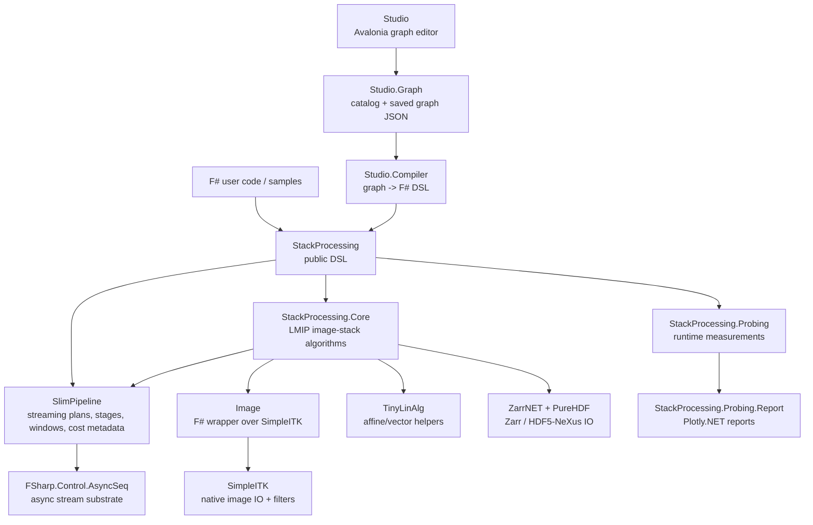

# FSharp.StackProcessing

`StackProcessing` is a toolkit for larger-than-memory image processing in F#.
It combines a streaming execution core (`SlimPipeline`), image-stack operations
(`StackProcessing` and `Image`), and a visual graph editor (`Studio`).

The central idea is simple: describe an image-processing workflow as a graph or
pipeline, then execute it slice by slice or chunk by chunk so that memory use
stays bounded.

```fsharp
open StackProcessing

let availableMemory = 2UL * 1024UL * 1024UL * 1024UL

source availableMemory
|> read<float> "image18" ".tiff"
>=> discreteGaussian 1.0 None None (Some 15u)
>=> cast<float,uint8>
>=> write "result18" ".tiff"
|> sink
```

Nothing runs while the pipeline is being built. Execution starts only when
`sink`, `drain`, or another terminal operation is called.

## Installation

StackProcessing is a .NET 10 F# solution. Install the .NET 10 SDK, clone the
repository, and run Studio from the `src/Studio` project:

```bash
git clone https://github.com/sporring/stackProcessing.git
cd stackProcessing
dotnet build StackProcessing.sln
dotnet run --project src/Studio/Studio.fsproj
```

The samples are ordinary F# console projects. For example:

```bash
cd samples/copy
dotnet run -- 18
dotnet run -- -d 1 18
```

The optional `-d` flag enables debug output. Levels `1`, `2`, and `3` add
increasingly detailed execution information.

## Projects

| Project | Role |
| ------- | ---- |
| `Image` | Thin F# image abstraction over SimpleITK, including typed pixel access and image functions. |
| `AsyncSeqExtensions` | Streaming helpers used by the pipeline engine. |
| `SlimPipeline` | Element-agnostic streaming pipeline model, graph metadata, memory estimates, and execution. |
| `TinyLinAlg` | Small affine/vector/matrix helper library used by registration and resampling code. |
| `StackProcessing` | Image-stack implementation of `SlimPipeline`: read, write, filters, reducers, visualization helpers. |
| `StackProcessing.Probing` | Runs calibration-style pipelines and writes JSON with memory and timing observations for cost-model learning. |
| `StackProcessing.Probing.Report` | Reads probing JSON and writes Plotly.NET scatter plots for memory and speed versus window size or other parameters. |
| `Studio.Graph` | Pure graph domain model, built-in function catalog, and JSON persistence for Studio. |
| `Studio.Compiler` | Compiler from Studio graph JSON to executable StackProcessing F# DSL code. |
| `Studio` | Avalonia visual editor for building, saving, arranging, compiling, and running processing graphs. |

## Component Overview



There are two user-facing entry points. Programmers can write the
`StackProcessing` DSL directly; non-programmers can build the same DSL through
Studio graphs. Both routes end in `SlimPipeline` plans and stages. The image
work is implemented in `StackProcessing.Core` and `Image`, while file formats,
registration helpers, probing, and reports sit beside that core path.

## Studio For Users


Studio is the visual way to build StackProcessing programs. It lets a user
compose useful larger-than-memory image workflows without writing F# by hand.

From the user's point of view, a Studio graph is a recipe: boxes describe where
data comes from, what processing should happen, what scalar values or statistics
are used as parameters, and where results should be written, printed, or shown.

The main screen contains:

| Area | Purpose |
| ---- | ------- |
| Palette | Searchable list of available boxes grouped by category. |
| Graph | The workspace where boxes are connected into a pipeline. |
| Parameters | Settings for the selected box. Many parameters can be supplied either as typed values or from graph input pins. |
| Output | Generated program text, build output, run output, and debug messages. |
| Overview | Small minimap of the graph canvas and current viewport. |

### Basic Workflow

1. Drag boxes from the Palette into the Graph.
2. Connect compatible triangle pins.
3. Select a box and adjust its Parameters.
4. Use `Save As` or `Save` to store the graph as JSON.
5. Press `Run` to generate F#, build it in a temporary run area, execute it, and stream output back to the Output panel.

`Load`, `Clear`, and window closing warn before discarding unsaved work. `Save`
is enabled only after a filename has been supplied by `Load` or `Save As`, and
only when the graph is dirty.

### Boxes And Pins

Studio distinguishes between data streams and scalar parameters.

| Pin kind | Direction | Meaning |
| -------- | --------- | ------- |
| Left/right white triangles | horizontal | Streaming image or tuple data. |
| Top brown triangles | downward into a box | Parameter inputs, such as filenames, sigma, thresholds, or scalar operands. |
| Bottom brown triangles | downward out of a box | Scalar or reducer outputs, such as constants, statistics fields, or translation tables. |

Parameter pins are optional unless a box declares them as always-on. If a
parameter is connected from the graph, its text field is disabled and the
generated code uses the connected value.

### Common Box Categories

| Category | Examples |
| -------- | -------- |
| Sources / Sinks | `read`, `readRandom`, `zero`, `write`, `writeThrough`, `scalar`, `getStackInfo` |
| Arithmetic | `scalarOp`, `imageOpScalar`, `scalarOpImage`, `imageOpImage`, `f(I)`, `f(a)` |
| Filters | `discreteGaussian`, `convGauss`, `finiteDiff` |
| Segmentation | `threshold`, morphology, connected-component stages |
| Statistics | `computeStats`, `histogram`, `quantiles`, object-size statistics |
| Visualization | `histogram`, `chart`, `showImage` |
| Debug | `tap`, `print` |

Many boxes are generic: for example `read` has a type dropdown instead of one
separate box per pixel type, `imageOpImage` has an operator dropdown including
`+`, `-`, `*`, `/`, `max`, and `min`, and `f(I)` / `f(a)` expose standard
function dropdowns. When a box is connected, Studio restricts type choices to
values compatible with the existing connection.

Scalar parameter fields accept ordinary typed literals. Numeric scalar fields
also accept `e` and `pi`, which compile to `System.Math.E` and
`System.Math.PI`; string fields keep those inputs as the literal strings `"e"`
and `"pi"`.

When a graph is run from Studio, relative file and directory names are resolved
relative to the graph's last `Load`, `Save`, or `Save As` location. If the graph
has never had a file location, Studio falls back to the user's home/root
directory.

Studio also tries to catch structural mistakes while the graph is being built.
It rejects incompatible pin types, cycles, and reducer/streaming combinations
that would require holding a full image stream in memory before a downstream
streaming path can continue.

### Run Output

Pressing `Run`:

1. Shows `Compiling` while the graph is translated to F# DSL text.
2. Creates or reuses a temporary build directory.
3. Shows `Building` while a small runner project is built.
4. Shows `Run` while the generated program executes.
5. Shows `Completed` when execution exits successfully.
6. Appends generated code, build logs, and program output to the Output panel.

This keeps the generated program visible for debugging while making Studio a
one-button path from graph to execution.

## Studio Design

Studio is deliberately split into three layers.

### `Studio.Graph`

`Studio.Graph` is the pure model used by Studio. It has no Avalonia dependency.
It defines:

```fsharp
type NumericType =
    | Number | UInt8 | Int8 | UInt16 | Int16
    | UInt32 | Int32 | UInt64 | Int64
    | Float32 | Float64 | Complex

type BasicType =
    | Numeric of NumericType
    | Bool
    | String
    | Map
    | Unit

type PortType =
    | Image of NumericType
    | Scalar of BasicType
    | Tuple of PortType * PortType
    | Custom of string
    | Any
    | Unit
```

The catalog in `BuiltInCatalog.fs` describes all boxes available in the Palette:
their ids, display names, categories, ports, parameters, aliases, and defaults.

The persistence model is intentionally separate from the runtime view model:

```fsharp
type SavedNode =
    { Id: string
      FunctionId: string
      X: float
      Y: float
      Parameters: SavedParameter array }

type SavedEdge =
    { FromNode: string
      FromKind: string
      FromPort: int
      ToNode: string
      ToKind: string
      ToPort: int }

type SavedGraph =
    { Version: int
      Nodes: SavedNode array
      Edges: SavedEdge array }
```

This JSON format is the stable boundary between Studio's UI and the compiler.

### `Studio.Compiler`

`Studio.Compiler` turns a `SavedGraph` into StackProcessing F# code. It resolves:

* box ids to StackProcessing functions,
* graph edges to pipeline composition,
* scalar boxes to `let` bindings,
* reducer outputs such as `ImageStats0.Mean`,
* linked parameter pins,
* branch and pair syntax such as `>=>>`, `zip`, and `>>=>`,
* print and tap formatting,
* terminal `sink` or `drain` calls.

The compiler also orders generated `let` bindings so that F# lexical scope is
respected. For example, if a string scalar is used by both `read` and
`readRandom`, its binding is emitted before either dependent pipeline.

The compiler is also where compact visual boxes are expanded back to the lower
level DSL. For example, an `imageOpImage` box with operator `*`, `max`, or `min`
becomes the corresponding pair operation (`mulPair`, `maxOfPair`, or
`minOfPair`) in generated F#, and a chart box expands to the Plotly.NET helper
code needed for the selected chart kind.

### `Studio`

The Avalonia project is responsible for interaction:

* Palette search and drag creation.
* Node selection and multi-selection.
* Group movement with canvas-boundary clamping.
* Type-aware connection highlighting.
* Connection guards, including cycle detection and reducer-stream misuse.
* Arrange and fit-view commands.
* Save/load/dirty-state workflow.
* Pan, zoom, minimap, and Output panel behavior.
* Running the compiler and external `dotnet` build/run process.

Studio's UI code is a shell around `Studio.Graph` and `Studio.Compiler`; graph
semantics and code generation live outside Avalonia view code.

## SlimPipeline Design

`SlimPipeline` is the element-agnostic streaming engine. It does not know about
images, SimpleITK, TIFF files, or Studio. Its job is to model and execute typed
streams with bounded memory.

### `Pipe<'S,'T>`

A `Pipe` is the executable form:

```fsharp
type Pipe<'S,'T> =
    { Name: string
      Apply: bool -> AsyncSeq<'S> -> AsyncSeq<'T>
      Profile: Profile }
```

It contains the actual function that transforms an `AsyncSeq<'S>` into an
`AsyncSeq<'T>`.

### `Stage<'S,'T>`

A `Stage` is the abstract description used while building the DSL:

```fsharp
type Stage<'S,'T> =
    { Name: string
      Build: unit -> Pipe<'S,'T>
      Transition: ProfileTransition
      MemoryNeed: MemoryNeedWrapped
      MemoryModel: StageMemoryModel
      CostModel: StageCostModel
      ElementTransformation: ElementTransformation
      SliceCardinality: SliceCardinality
      Graph: PipelineGraph
      Cleaning: (unit -> unit) list }
```

The distinction matters:

* `Stage` is analyzable and composable.
* `Pipe` is executable.
* `sink` and `drain` transform a `Stage` into a `Pipe` and run it.

This separation lets the system analyze the abstract graph before execution.

### Pipeline Graph Metadata

As the DSL is composed, SlimPipeline builds a graph:

```fsharp
type PipelineGraphNode =
    { Id: int
      Name: string
      Transition: ProfileTransition }

type PipelineGraphEdge =
    { From: int
      To: int
      Label: string }

type PipelineGraph =
    { Nodes: PipelineGraphNode list
      Edges: PipelineGraphEdge list
      Entries: int list
      Exits: int list }
```

This graph records composition, branching, joining, and stage boundaries while
keeping the runtime `Pipe` path intact.

### Profiles And Memory

`Profile` describes how much stream context a stage needs:

```fsharp
type Profile =
    | Unit
    | Constant
    | Streaming
    | Window of uint * uint * uint * uint * uint
```

`Streaming` means an element can be processed independently. `Window` means
neighbouring elements must be held together. Reducers move from streaming input
to constant output.

Windowed stages use a first-class low-level representation:

```fsharp
type Window<'T> =
    { Items: 'T list
      EmitRange: uint * uint }
```

`Items` is the retained context for the current window. `EmitRange` identifies
the subrange that should be released when the window is flattened back into the
ordinary element stream. Singleton streaming can be treated as a one-item
window when stages need synchronized window semantics.

Each stage also has:

* `MemoryNeed`: estimate of required memory for a slice or pair of slices.
* `MemoryModel` and `CostModel`: structured estimates used by probing and optimization.
* `ElementTransformation`: estimate of the x-y element shape after the stage.
* `SliceCardinality`: logical z-domain change after the stage.
* `Cleaning`: delayed cleanup actions run after terminal operations.

`SliceCardinality` uses small composable slice domains such as preserve, trim,
expand, skip, and take. Branch synchronization uses these domains to reject
incompatible stream lengths before a deadlock-prone pipeline is run.

### `ResourceOps<'T>`

Memory release is explicit because larger-than-memory image processing cannot
wait for the .NET GC to notice that large native images are no longer useful.

```fsharp
type ResourceOps<'T> =
    { Retain: 'T -> unit
      Release: 'T -> unit
      MemoryOf: 'T -> uint64 option }
```

`SlimPipeline` stays functional: resource behavior is passed as a record of
functions, not through an inheritance hierarchy. `StackProcessing` supplies
image-specific operations that increment and decrement image reference counts.

### `Plan<'S,'T>`

A `Plan` is the user's partially built pipeline:

```fsharp
type Plan<'S,'T> =
    { stage: Stage<'S,'T> option
      graph: PipelineGraph
      sourcePeek: SourcePeek option
      costPeak: StageCostEstimate option
      costObservations: StageCostEstimate list
      nElemsPerSlice: SingleOrPair
      length: uint64
      memAvail: uint64
      memPeak: uint64
      debug: bool
      debugLevel: uint }
```

The source creates an empty plan. Composition operators add stages. Terminal
operators build and execute the final pipe.

### SlimPipeline Operators

| Operator | Purpose |
| -------- | ------- |
| `>=>` | Append a stage to a plan. |
| `-->` | Compose two stages directly. |
| `>=>>` | Split one stream into two synchronized branches. |
| `zip` | Combine two compatible plans elementwise. |
| `>>=>` | Combine paired results with a function. |
| `>>=>>` | Apply synchronized stages to the two sides of an existing paired stream. |
| `teeFst` / `teeSnd` | Apply a side-effecting identity stage to one side of a pair. |

## StackProcessing Design

`StackProcessing` specializes `SlimPipeline` for image stacks. It provides the
user-facing F# DSL and binds generic stream operations to image operations.

### Sources And Sinks

Typical sources:

```fsharp
read<'T> inputDir suffix
readRandom<'T> depth inputDir suffix
readRange<'T> first step last inputDir suffix
readSlab<'T> inputDir suffix
readZarrSlab<'T> inputDir arrayPath
readNexusSlab<'T> inputFile datasetPath
readPointSet inputCsv
zero<'T> width height depth
```

Typical sinks:

```fsharp
write outputDir suffix
writeInSlabs outputDir suffix chunkX chunkY chunkZ
writeZarr outputDir arrayPath chunkX chunkY chunkZ
writeNexus outputFile datasetPath chunkX chunkY chunkZ
writePointSet outputCsv
writeMesh outputPath format
sink
drain
```

`write` is a stage with the side effect of writing images. This allows variants
such as write-through processing, where a value is written and still passed
downstream.

### Image Stages

StackProcessing wraps image functions as `Stage`s:

* image-image arithmetic and comparison,
* scalar-image operations,
* local filters, morphology, resampling, and convolution,
* streaming-friendly segmentation and connected-object processing,
* reducers for statistics, histograms, quantiles, objects, and label tables,
* point sets, meshes, registration, debug, and visualization helpers.

Studio may present several of these concrete functions as one generic box with
an operator or type dropdown. The generated code still targets the concrete
StackProcessing DSL functions.

### Image Processing Algorithm Inventory

The public `StackProcessing` DSL exposes algorithms that fit the
larger-than-memory model. Operations that need whole-volume iterative access,
such as full-image watershed, thinning, full signed distance maps, or
whole-stack normalization, are not part of the streaming DSL surface.

| Area | DSL functions |
| ---- | ------------- |
| Type conversion and creation | `cast`, `zero`, `empty`, `createByEuler2DTransform` |
| Arithmetic | `add`, `sub`, `mul`, `div`, `addPair`, `subPair`, `mulPair`, `divPair`, `maxOfPair`, `minOfPair` |
| Scalar-image arithmetic | `scalarAddImage`, `imageAddScalar`, `scalarSubImage`, `imageSubScalar`, `scalarMulImage`, `imageMulScalar`, `scalarDivImage`, `imageDivScalar` |
| Pointwise math | `abs`, `acos`, `asin`, `atan`, `cos`, `sin`, `tan`, `exp`, `log10`, `log`, `round`, `sqrt`, `sqrtWindowed`, `square`, `clamp` |
| Intensity mapping | `shiftScale`, `intensityStretch`, `threshold`, `addNormalNoise` |
| Comparisons and masks | `equal`, `notEqual`, `greater`, `greaterEqual`, `less`, `lessEqual`, `andMask`, `orMask`, `xorMask`, `notMask` |
| Local filtering | `median`, `bilateral`, `gradientMagnitude`, `sobelEdge`, `laplacian`, `discreteGaussian`, `convGauss`, `convolve`, `conv`, `finiteDiff` |
| Binary morphology | `erode`, `dilate`, `opening`, `closing`, `binaryContour`, `binaryMedian` |
| Grayscale morphology | `grayscaleErode`, `grayscaleDilate`, `grayscaleOpening`, `grayscaleClosing`, `whiteTopHat`, `blackTopHat`, `morphologicalGradient` |
| Padding, cropping, axes, and geometry | `createPadding`, `crop`, `resize`, `resample`, `resampleAffineTrilinearSlices`, `permuteAxes` |
| Connected components and labels | `connectedComponents`, `relabelComponents`, `makeConnectedComponentTranslationTable`, `updateConnectedComponents`, `labelContour`, `changeLabel` |
| Streaming object processing | `streamConnectedObjects`, `removeSmallObjects`, `fillSmallHoles`, `paintObjects`, `paintObjectsCropped`, `measureObjects`, `objectSizeStats`, `objectSizeHistogram` |
| Distance, surfaces, and features | `signedDistanceBand`, `marchingCubes`, `dogKeypoints` |
| Point sets and registration | `readPointSet`, `writePointSet`, `earthMoversDistance`, `transformPointSet`, `inverseAffine`, `affineRegistration` |
| Reducers and summaries | `computeStats`, `histogram`, `quantiles`, `otsuThresholdFromHistogram`, `momentsThresholdFromHistogram`, `sumProjection` |
| Visualization and diagnostics | `show`, `plot`, `print`, `tap`, `tapIt` |

Threshold estimation uses the pattern
`histogram -> otsuThresholdFromHistogram` or
`histogram -> momentsThresholdFromHistogram`, followed by the ordinary streaming
`threshold` stage. This makes the sampling and two-pass nature explicit.

### Larger-Than-Memory Connected Components

Connected components use two passes for large stacks. The DSL expresses this
as a linear tuple stream:

```fsharp
let transTbl =
    source availableMemory
    |> read<uint8> input ".tiff"
    >=> threshold 128.0 infinity
    >=> connectedComponents wsz
    >=> teeFst (writeSlabSlices tmp ".mha" wsz)
    >=> makeConnectedComponentTranslationTable wsz
    |> drain

// transTbl.Labels contains the per-slab to global-label mapping.
// transTbl.Statistics contains streaming component counts, bounds, and centroids.

source availableMemory
|> read<uint64> tmp ".mha"
>=> updateConnectedComponents wsz transTbl
>=> cast<uint64,uint8>
>=> write output ".tiff"
|> sink
```

`connectedComponents` returns label slabs paired with object counts. The
translation-table reducer uses chunk counts and boundary comparisons to build a
total mapping. Temporary labels are stored losslessly, for example as `.mha`,
before the second pass collapses labels and writes displayable output.

## Development And Tests

Test projects are split by layer:

| Test project | Focus |
| ------------ | ----- |
| `AsyncSeqExtensions.Tests` | Async sequence helpers. |
| `SlimPipeline.Tests` | Profiles, resource ops, graph metadata, and basic execution. |
| `Image.Tests` | Image abstraction and image functions. |
| `TinyLinAlg.Tests` | Small vector/matrix/affine helpers. |
| `StackProcessing.Tests` | Streaming image correctness against direct 3D image operations where practical. |
| `Studio.Graph.Tests` | Graph domain, catalog, and persistence. |
| `Studio.Compiler.Tests` | Graph-to-F# code generation. |

Useful commands:

```bash
dotnet build StackProcessing.sln
dotnet test tests/AsyncSeqExtensions.Tests/AsyncSeqExtensions.Tests.fsproj
dotnet test tests/SlimPipeline.Tests/SlimPipeline.Tests.fsproj
dotnet test tests/StackProcessing.Tests/StackProcessing.Tests.fsproj
dotnet test tests/TinyLinAlg.Tests/TinyLinAlg.Tests.fsproj
dotnet test tests/Studio.Graph.Tests/Studio.Graph.Tests.fsproj
dotnet test tests/Studio.Compiler.Tests/Studio.Compiler.Tests.fsproj
dotnet test tests/Image.Tests/Image.Tests.fsproj
```

## Design Philosophy

* Build pipelines as typed, composable descriptions before execution.
* Keep `SlimPipeline` independent of images and UI.
* Keep Studio's graph model and compiler independent of Avalonia.
* Make memory ownership explicit for large native resources.
* Prefer streaming and chunked algorithms over full-volume materialization.
* Let users choose between visual programming in Studio and direct F# DSL code.

## Acknowledgements

StackProcessing builds on a lot of excellent open-source work. In particular:

* The SimpleITK and ITK teams provide the image IO, typed image representation,
  and many of the native image filters wrapped by the `Image` project.
* The FSharp.Control.AsyncSeq team provides the asynchronous sequence substrate
  used by `SlimPipeline` to express streaming execution.
* The Avalonia, NodeEditorAvalonia, PanAndZoom, and CommunityToolkit.Mvvm
  projects make the cross-platform Studio UI possible.
* Plotly.NET is used for probing reports, histograms, and visual summaries.
* PureHDF and ZarrNET provide native .NET access to HDF5/NeXus and Zarr-style
  array storage.
* Expecto, YoloDev.Expecto.TestSdk, Microsoft.NET.Test.Sdk, and coverlet support
  the test and coverage setup.
* DIKU.Graph supports graph algorithms used inside the stack-processing core.

## How To Cite

Sporring, J. and Stansby, D. Larger than memory image processing, January 2026,
[https://arxiv.org/abs/2601.18407](https://arxiv.org/abs/2601.18407)
