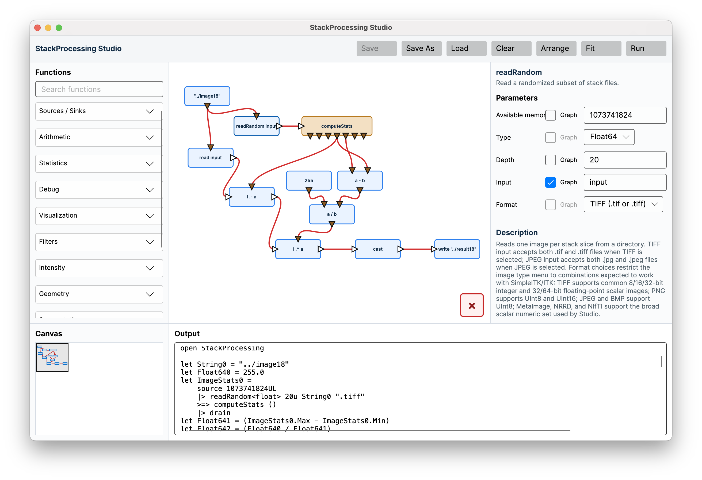
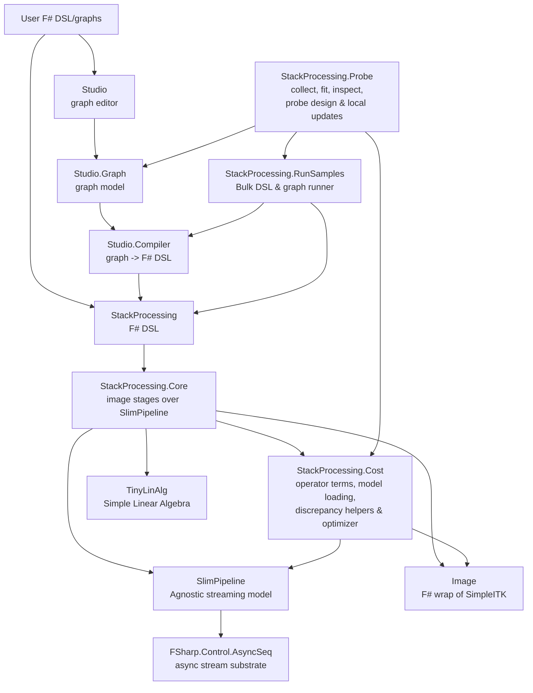

# FSharp.StackProcessing

`StackProcessing` is a toolkit for larger-than-memory image processing (LMIP) in F#.
It targets analysis of 3-dimensional volume images such as microscope, medical, and synchrotron volumes. It combines a streaming execution core, image-stack operations, and a visual graph editor. You do not need to know F# to use `StackProcessing`.

The central idea is simple: describe an image-processing workflow as a graph or
pipeline, then execute it slice by slice or chunk by chunk so that memory use stays bounded. 

## Installation

StackProcessing is a .NET 10 F# solution. Install the .NET 10 SDK, clone the
repository, and run Studio from the `src/Studio` project:

```bash
git clone https://github.com/sporring/stackProcessing.git
cd stackProcessing
dotnet build StackProcessing.sln
dotnet run --project src/Studio/Studio.fsproj
```

`StackProcessing` relies on the SimpleITK C# binaries, which can be downloaded from the
[SimpleITK GitHub releases](https://github.com/SimpleITK/SimpleITK/releases) - 
look for a CSharp archive for your platform. It should contain
`SimpleITKCSharpManaged.dll` and the matching native library
(`libSimpleITKCSharpNative.dylib`, `libSimpleITKCSharpNative.so`, or
`SimpleITKCSharpNative.dll`). The repository `lib/` directory is where the
sample projects expect those files.

## Studio For Users

Studio is the visual way to build StackProcessing programs. It lets a user
compose useful larger-than-memory image workflows without writing F# by hand.



From the user's point of view, a Studio graph is a recipe: boxes describe where
data comes from, what processing should happen, what scalar values or statistics
are used as parameters, and where results should be written, printed, or shown.

The main screen contains:

| Area | Purpose |
| ---- | ------- |
| Palette | Searchable list of available boxes grouped by category. |
| Graph | The workspace where boxes are connected into a pipeline. |
| Parameters | Settings for the selected box. Many parameters can be supplied either as typed values or from graph input pins. |
| Output | Generated program text, build output, run output, and debug messages. |
| Overview | Small minimap of the graph canvas and current viewport. |

### Basic Workflow

1. Drag boxes from the Palette into the Graph.
2. Connect compatible triangle pins.
3. Select a box and adjust its Parameters.
4. Use `Save As` or `Save` to store the graph as JSON.
5. Press `Run` to generate F#, build it in a temporary run area, execute it, and stream output back to the Output panel.

`Load`, `Clear`, and window closing warn before discarding unsaved work. `Save`
is enabled only after a filename has been supplied by `Load` or `Save As`, and
only when the graph is dirty.

### Boxes And Pins

Studio distinguishes between data streams and scalar parameters.

| Pin kind | Direction | Meaning |
| -------- | --------- | ------- |
| Left/right white triangles | horizontal | Streaming image or tuple data. |
| Top brown triangles | downward into a box | Parameter inputs, such as filenames, sigma, thresholds, or scalar operands. |
| Bottom brown triangles | downward out of a box | Scalar or reducer outputs, such as constants, statistics fields, or translation tables. |

Parameter pins are optional unless a box declares them as always-on. If a
parameter is connected from the graph, its text field is disabled and the
generated code uses the connected value.

### Common Box Categories

| Category | Examples |
| -------- | -------- |
| Sources / Sinks | `read`, `readRandom`, `readRange`, `readSlab`, `readPointSet`, `zero`, coordinate images, noise sources, `write`, `writeChunks`, `writeCSV`, `writeMesh`, `scalar`, read/write info outputs |
| Arithmetic | `scalarOp`, `imageOpScalar`, `scalarOpImage`, `imageOpImage`, `f(I)`, `f(a)` |
| Filters | `smoothWGauss`, `smoothWMedian`, `smoothWBilateral`, `finiteDiff`, `gradient`, `structureTensor`, `FFT`, `invFFT`, `shiftFFT` |
| Segmentation | `threshold`, morphology, connected-component stages, streaming objects |
| Statistics | `computeStats`, `estimateHistogram`, `histogramEqualization`, `quantiles`, object-size statistics, `volume`, `surfaceArea`, PCA |
| Points / Meshes / Registration | 3D keypoints, point-set registration, point-pair distances, marching cubes, manifest items |
| Serial Sections | slice-wise bias correction, 2D keypoints, slice translation manifests, manifest application |
| Visualization | `histogram`, `chart`, `showImage`, `print`, `tap` |
| Debug | `tap`, `print` |

Many boxes are generic: for example `read` has a type dropdown instead of one
separate box per pixel type, `imageOpImage` has an operator dropdown including
`+`, `-`, `*`, `/`, `max`, and `min`, and `f(I)` / `f(a)` expose standard
function dropdowns. When a box is connected, Studio restricts type choices to
values compatible with the existing connection.

Scalar parameter fields accept ordinary typed literals. Numeric scalar fields
also accept `e` and `pi`, which compile to `System.Math.E` and
`System.Math.PI`; string fields keep those inputs as the literal strings `"e"`
and `"pi"`.

When a graph is run from Studio, relative file and directory names are resolved
relative to the graph's last `Load`, `Save`, or `Save As` location. If the graph
has never had a file location, Studio falls back to the user's home/root
directory.

Studio also tries to catch structural mistakes while the graph is being built.
It rejects incompatible pin types, cycles, and reducer/streaming combinations
that would require holding a full image stream in memory before a downstream
streaming path can continue.

### Run Output

Pressing `Run`:

1. Shows `Compiling` while the graph is translated to F# DSL text.
2. Creates or reuses a temporary build directory.
3. Shows `Building` while a small runner project is built.
4. Shows `Running` while the generated program executes.
5. Shows `Completed` and the runtime when execution exits successfully.
6. Appends generated code, build logs, debug output, and program output to the Output panel.

This keeps the generated program visible for debugging while making Studio a
one-button path from graph to execution.

## Domain Specific Language (DSL)
Underneath Studio is the Domain Specific Language (DSL) implemented in F#. An example is given below.

```fsharp
open StackProcessing

let availableMemory = 2UL * 1024UL * 1024UL * 1024UL

source availableMemory
|> read<float> "../data/volume" ".tiff"
>=> smoothWGauss 1.0 None None (Some 15u)
>=> cast<float,uint8>
>=> write "../tmp/smoothedVolume" ".tiff"
|> sink
```

The pipeline is constructed in a single pass. When
`sink`, `drain`, or another terminal operation is called, then the pipeline is optimized for fastest running time within the limits of the specified available memory, and then the pipeline is executed.

## Samples

The `samples/` tree is an illustrative library and a smoke-test collection.
Most sample folders contain both a compact F# program and the matching Studio
JSON graph. The F# files show the public DSL directly; the JSON files show the
same workflow as visual boxes.

The samples are ordinary F# console projects. Most sample paths are written
relative to the sample folder, so run individual samples from their own
directory:

```bash
cd samples/copy
dotnet run
```
The optional `-d` flag enables debug output:

```bash
dotnet run -- -d 1
```
Level `1` reports read and write
progress only. Level `2` adds plan, stage, and optimization summaries. Level
`3` adds process RSS measurements. Optimizer control is intentionally separate
from debug level so timing runs can opt out of optimization without changing
diagnostic verbosity. The sample runners default to optimizer off; pass
`--optimize true` to `StackProcessing.RunSamples` to opt back in for
comparison runs.

The samples follow a common convention:

* samples with file inputs read from `../data/`; synthetic-source samples may
  have no input file,
* generated images, meshes, and temporary artifacts go to `../tmp/`,
* image outputs prefer TIFF stacks when that makes visual inspection easy;
  chunk-writing examples and typed intermediates that TIFF cannot represent may
  use formats such as `.mha`,
* helper functions are kept to a minimum so the sample reads like a pipeline.

Examples worth starting with:

| Sample | Demonstrates |
| ------ | ------------ |
| `objectsSizeHistogram` | streaming connected objects, object measurements, reducer branches, histogram, and chart output |
| `objectsMarchingCubes` | streaming object surfaces and mesh writing |
| `structureTensor` | vector-image output from structure tensor, component range selection, and color conversion |
| `sumProjection` | projection reducers |
| `closing` | binary closing on a 0/1 UInt8 mask |
| `convolve` | a custom 3D convolution kernel and boundary/window settings |
| `quantileClamp` | histogram sampling, quantiles, intensity stretch, and outlier clamping |
| `dilate`, `opening`, `binaryMedian`, `binaryContour`, `fillSmallHoles`, `grayscaleErode`, `grayscaleDilate`, `grayscaleOpening`, `grayscaleClosing`, `whiteTopHat`, `blackTopHat`, `morphologicalGradient` | morphology families with small inspectable pipelines |
| `smoothWGauss`, `smoothWMedian`, `smoothWBilateral`, `sobelEdge`, `laplacian`, `gradientMagnitude` | focused filter smoke tests |
| `saltAndPepperNoise`, `shotNoise`, `speckleNoise`, `addSaltAndPepperNoise`, `addShotSpeckleNoise`, `meshMeasurement` | focused tours through related Studio boxes |
| `siftKeypoints`, `hessianKeypoints`, `harris3DKeypoints`, `forstner3DKeypoints` | one keypoint detector per sample |

These samples are also useful when adding or changing Studio boxes:
each exposed box should ideally appear in at least one sample graph so that the
graph-to-DSL path stays easy to inspect.

## F# Interactive

You can experiment with the DSL in F# Interactive (fsi) after building the
`StackProcessing` and `StackProcessing.Probe` projects. The Probe output folder
is used here only because it contains the copied NuGet dependency
`FSharp.Control.AsyncSeq.dll`. Start `dotnet fsi` from the repository root and
make sure the native SimpleITK library is visible before fsi starts.

On macOS:

```bash
cd <root of StackProcessing>
dotnet build
DYLD_LIBRARY_PATH="$(pwd)/src/StackProcessing/bin/Debug/net10.0:$(pwd)/lib" dotnet fsi
```

On Linux use `LD_LIBRARY_PATH` in the same way. On Windows, start fsi from an
environment where the build output and `lib/` are on `PATH`.

Inside F# Interactive, the shortest setup is:

```fsharp
#load "scripts/stackprocessing.fsx";;
open StackProcessing;;

let availableMemory = 2UL * 1024UL * 1024UL * 1024UL;;

source availableMemory
|> zero<uint8> 64u 64u 8u
>=> write "tmp/fsi-zero" ".tiff"
|> sink;;
```

The helper script loads the same assemblies as this manual setup:

```fsharp
#I "src/StackProcessing.Probe/bin/Debug/net10.0";;
#I "src/StackProcessing/bin/Debug/net10.0";;
#r "FSharp.Control.AsyncSeq.dll";;
#r "SimpleITKCSharpManaged.dll";;
#r "AsyncSeqExtensions.dll";;
#r "TinyLinAlg.dll";;
#r "Image.dll";;
#r "SlimPipeline.dll";;
#r "StackProcessing.Cost.dll";;
#r "StackProcessing.Core.dll";;
#r "StackProcessing.dll";;

```

Paths in fsi are resolved relative to the directory where `dotnet fsi` was
started. If you want to paste a sample program that uses paths such as
`../data/volume`, start fsi from that sample folder and use absolute `#I`
paths back to the built assemblies.

## Measurement And Calibration

`StackProcessing.RunSamples` is the shared runner for sample measurements. It
runs F# sample projects by default and Studio JSON graphs with `--json`.
Runner logs and gathered CSVs are written below the repository-level `tmp/`
directory. Temporary generated JSON runner projects still live below
`samples/tmp/`, keeping sample-local scratch files separate from analysis
outputs.

```bash
dotnet run --project src/StackProcessing.RunSamples/RunSamples.fsproj -- --repeat 3 -j 1 --optimize false
dotnet run --project src/StackProcessing.RunSamples/RunSamples.fsproj -- --json --repeat 3 -j 1 --optimize false
```

`StackProcessing.Probe` is the front door for cost-model work. Probe now keeps
measurement collection and model fitting separate. Collection appends durable
raw measurements to `measurements/stackprocessing-probe.jsonl`; fitting can then
select any subset of that evidence without rerunning the same probe graphs. The
measurement store is deliberately ignored by git because it can grow quickly.

The intended control split is:

* `collect` proposes/runs probe programs for a selected ladder family, member,
  or inspect-generated request and logs the raw evidence;
* `fit` reads selected evidence from the measurement store and writes a fitted
  model plus diagnostics;
* `inspect` summarizes stored coverage, evaluates fit quality in the selected
  scope, and can write a request JSON for the next `collect --request` run.

The implicit calibration ladder is:

```text
io -> io-cast -> sources -> singleton -> neighbourhood -> geometry -> fourier -> keypoints -> dependency -> reducers
```

There is also an explicit `window-slab` family for measuring window-to-slab,
slab-to-window, and z-agnostic singleton-on-slab scaffolding. It is intentionally
not included by `fit --up-to`, `inspect --max-step`, or the implicit fit
selector for `--family all`, because those measurements are useful for
implementation experiments but can otherwise blur the ordinary operator fit.
Request it by name when you want it.

The `io` family measures native image-stack read/write behavior without
intentional casting. It now expands supported pixel type and suffix combinations
instead of treating IO as a single type-only surface. TIFF is measured for the
types StackProcessing exposes as TIFF-compatible, while `.mha` covers the wider
scalar set and complex images. SimpleITK image writes are requested without
compression by default so the fitted IO model reflects the ordinary user-facing
DSL behavior.

The `io-cast` family compares implicit `read<T>` conversion with explicit
`read<diskT> --> cast<diskT,T>` graphs. Fitting decomposes those measurements
into `Read(diskT.suffix)` evidence plus `Cast(diskT->T)` evidence, so widening
reads are modeled as source-format IO followed by conversion rather than as a
pure target-type read.

The usual workflow is:

1. clean old generated scratch data and, when starting a new fitting cycle,
   archive previous fitted/local models,
2. collect IO evidence across the relevant shapes and types,
3. fit and inspect the model through IO,
4. move upward through `io-cast`, `singleton`, and `neighbourhood` only when the
   lower layer looks plausible,
5. run the sample suite with discrepancy reporting enabled,
6. use `inspect --suggest ...` followed by `collect --request ...`, or
   `local-update`, for compact targeted evidence around flagged operators.

```bash
rm -rf tmp/*
mkdir -p models/archive
mv models/fitted models/archive/fitted_$(date +%Y%m%d_%H%M%S) 2>/dev/null || true
mv models/local models/archive/local_$(date +%Y%m%d_%H%M%S) 2>/dev/null || true
dotnet run --project src/StackProcessing.Probe/StackProcessing.Probe.fsproj -- \
  collect --family io \
  --shapes 256x256x256,512x512x128,1024x1024x64 \
  --noisy-type Float32 --repeat 3 -j 1
dotnet run --project src/StackProcessing.Probe/StackProcessing.Probe.fsproj -- \
  fit --up-to io
dotnet run --project src/StackProcessing.Probe/StackProcessing.Probe.fsproj -- \
  inspect --max-step io --min-repeats 3 --suggest tmp/inspect/io-request.json
dotnet run --project src/StackProcessing.Probe/StackProcessing.Probe.fsproj -- \
  collect --family io-cast \
  --shapes 256x256x256,512x512x128,1024x1024x64 \
  --noisy-type Float32 --repeat 3 -j 1
dotnet run --project src/StackProcessing.Probe/StackProcessing.Probe.fsproj -- \
  fit --up-to io-cast
dotnet run --project src/StackProcessing.Probe/StackProcessing.Probe.fsproj -- \
  inspect --max-step io-cast --min-repeats 3 --suggest tmp/inspect/io-cast-request.json
rm -f tmp/costDiscrepancies.csv
dotnet run --project src/StackProcessing.RunSamples/RunSamples.fsproj -- \
  --skip-build --repeat 1 -j 1 --debug-level 1 --cost-discrepancies \
  --cost-flags tmp/costDiscrepancies.csv \
  --cost-model models/fitted/stackprocessing.operator-cost.json --no-optimize
dotnet run --project src/StackProcessing.Probe/StackProcessing.Probe.fsproj -- \
  local-update --shape 256x256x256 --repeat 3 -j 1
```

When `inspect` writes a request, collect it directly:

```bash
dotnet run --project src/StackProcessing.Probe/StackProcessing.Probe.fsproj -- \
  collect --request tmp/inspect/io-cast-request.json -j 1
```

`--sizes` is a cubic shortcut. For rectangular volumes, use `--shape` or
`--shapes`. Probe also accepts shorthand such as `256^3` and `512^2*128`,
but `WxHxD` spelling is clearer and avoids shell globbing surprises:

```bash
dotnet run --project src/StackProcessing.Probe/StackProcessing.Probe.fsproj -- \
  collect --all --shapes 256x256x256,512x512x128,1024x1024x64 --noisy-type Float32 --repeat 3 -j 1
```

For fitting and inspection, `all` follows the implicit ladder and excludes
`window-slab`. Collection is lower-level: `collect --all` delegates to the
bottom-up probe phases and includes every phase. Prefer explicit `--family`
collections when building the model slowly.

For slower model development, use explicit families instead of running every
stage class at once. Because `collect` appends to the durable measurement store
and `fit` selects from it, later model experiments do not require recollecting
IO unless `inspect` reports missing, stale, or poor-quality evidence:

```bash
dotnet run --project src/StackProcessing.Probe/StackProcessing.Probe.fsproj -- \
  collect --family io --shapes 256x256x256,512x512x128,1024x1024x64 --noisy-type Float32 --repeat 3 -j 1
dotnet run --project src/StackProcessing.Probe/StackProcessing.Probe.fsproj -- \
  collect --family io-cast --shapes 256x256x256,512x512x128,1024x1024x64 --noisy-type Float32 --repeat 3 -j 1
dotnet run --project src/StackProcessing.Probe/StackProcessing.Probe.fsproj -- \
  collect --family singleton --shapes 256x256x256,512x512x128,1024x1024x64 --noisy-type Float32 --repeat 3 -j 1
dotnet run --project src/StackProcessing.Probe/StackProcessing.Probe.fsproj -- \
  fit --up-to singleton
```

For a first, faster calibration pass, use a single size:

```bash
dotnet run --project src/StackProcessing.Probe/StackProcessing.Probe.fsproj -- collect --family io --size 128 --noisy-type Float32 --repeat 3 -j 1
```

For development-only graph emission without running the generated probes:

```bash
dotnet run --project src/StackProcessing.Probe/StackProcessing.Probe.fsproj -- collect --family io --size 64 --no-run-probes
```

The controlled collection path clears repository `tmp/` by default, generates
its own binary shape and noisy gray-valued input stacks below
`tmp/probeInputs`, and writes controlled graph batches below
`tmp/probingGraphs/bottomup_*/layer_###_*`. The first layer measures empty,
minimal traversal, read, write, and typed IO patterns; later layers add
sources, scalar/unary stages, optional window-slab scaffolding, neighbourhood
stages, geometry, FFT/vector/keypoint probes, and dependency-breakers for
under-isolated features. Probe writes normalized fitting evidence to
`tmp/analysis/costEvidence.csv` and appends durable raw measurements to
`measurements/stackprocessing-probe.jsonl`. `fit` writes the reusable fitted
operator model to `models/fitted/stackprocessing.operator-cost.json`. The
repository fallback model lives in `models/default/stackprocessing.operator-cost.json`,
and targeted updates are written to `models/local/stackprocessing.operator-cost.json`.
Use `collect --family` to restrict controlled collection to `io`, `io-cast`,
`sources`, `singleton`, `window-slab`, `neighbourhood`, `geometry`, `fourier`,
`keypoints`, `dependency`, `reducers`, or `all`. Use `--keep-tmp` only when
deliberately preserving existing generated scratch files.

During fitting, the empty graph defines the common intercept and `Ignore` is
fixed at zero cost. This keeps the baseline from being absorbed into the
minimal traversal sink and gives read/write/stage estimates a stable anchor.

For timing calibration, prefer `-j 1` so sample and probe graphs do not compete
for CPU, memory bandwidth, or SimpleITK worker threads. Calibration and
validation runs should keep the optimizer off; `collect`, `bottom-up`, and
`local-update` pass `--optimize false` when they run emitted probe graphs.
Do not clean `tmp/` during a single collection or local-update command: the
timestamped `runJson_*` directories are the scratch evidence consumed by Probe
before durable records are appended.

Runtime debug can flag large model discrepancies for later analysis:

```bash
cd samples/someSample
dotnet run -- -d 1 --cost-discrepancies \
  --cost-flags tmp/costDiscrepancies.csv \
  --cost-model models/fitted/stackprocessing.operator-cost.json \
  --no-optimize
```

Relative `--cost-flags` and `--cost-model` paths are resolved from the
repository root when possible, so sample-root execution can still write flags to
repository `tmp/` and read models from repository `models/`.

For a targeted local update after one or more flagged sample runs:

```bash
dotnet run --project src/StackProcessing.Probe/StackProcessing.Probe.fsproj -- local-update --operators SmoothWMedian --sizes 64 --repeat 3 -j 1
```

This writes a local overlay model to
`models/local/stackprocessing.operator-cost.json`. When `--operators` is
omitted, Probe reads `tmp/costDiscrepancies.csv`, identifies likely suspects
from the flagged pipeline terms, emits focused read/zero/ignore/write probes,
and blends the new coefficients with the current model using
confidence-weighted momentum. Well-supported coefficients move slowly; sparse
or newly measured coefficients can move faster.

When `--cost-model` is omitted, StackProcessing looks for a model in
`STACKPROCESSING_COST_MODEL`, `~/.stackprocessing/cost/`, `models/fitted/`, and
finally `models/default/`. This lets local calibration replace the model
without changing code.

## Projects

| Project | Role |
| ------- | ---- |
| `Image` | Thin F# image abstraction over SimpleITK, including typed pixel access and image functions. |
| `AsyncSeqExtensions` | Low-level async sequence helpers used behind the pipeline engine. |
| `SlimPipeline` | Element-agnostic streaming pipeline model, graph metadata, resource-aware stream combinators, memory estimates, and execution. |
| `TinyLinAlg` | Small affine/vector/matrix helper library used by registration and resampling code. |
| `StackProcessing.Cost` | Image-stage cost terms, model loading/serialization, fitted/local/default model evaluation, discrepancy helpers, and semantics-preserving optimization choices. |
| `StackProcessing.Core` | Streaming image-stack algorithms, IO, manifests, stitching, points, meshes, bias correction, and serial-section tools. |
| `StackProcessing` | Public F# DSL over `StackProcessing.Core` and `SlimPipeline`. |
| `StackProcessing.RunSamples` | Runs sample F# projects by default, or Studio JSON graphs with `--json`, and writes repeatable timing/memory logs. |
| `StackProcessing.Probe` | Calibration front door: collects durable measurements, fits cost models, inspects fit quality, emits probe graphs, and writes reports for cost-model learning. |
| `Studio.Graph` | Pure graph domain model, built-in function catalog, and JSON persistence for Studio. |
| `Studio.Compiler` | Compiler from Studio graph JSON to executable StackProcessing F# DSL code. |
| `Studio` | Avalonia visual editor for building, saving, arranging, compiling, and running processing graphs. |

## Component Overview



There are two user-facing entry points. Programmers can write the
`StackProcessing` DSL directly; non-programmers can build the same DSL through
Studio graphs. Both routes end in `SlimPipeline` plans and stages. The image
work is implemented in `StackProcessing.Core` and `Image`. `StackProcessing.Cost`
provides the image-specific cost model consumed by Core at runtime and updated
by Probe from measured evidence. Cost still uses a few SlimPipeline cost and
graph types internally, but image stages acquire cost behavior through Core
rather than through generic SlimPipeline code. This is a pragmatic split:
Cost is a model of the Core image implementation, so if the boundary becomes
too awkward, the cleaner direction is to fold Cost into Core rather than make
Cost depend on Core while Core also depends on Cost. `RunSamples` supplies
repeatable sample measurements and discrepancy logs; Probe keeps durable raw
measurements separate from model fitting, then uses `inspect` to request
focused additional collection when the selected evidence is weak.

## Studio Design

Studio is deliberately split into three layers.

### `Studio.Graph`

`Studio.Graph` is the pure model used by Studio. It has no Avalonia dependency.
It defines:

```fsharp
type NumericType =
    | Number | UInt8 | Int8 | UInt16 | Int16
    | UInt32 | Int32 | UInt64 | Int64
    | Float32 | Float64 | Complex

type BasicType =
    | Numeric of NumericType
    | Bool
    | String
    | Map
    | Unit

type PortType =
    | Image of NumericType
    | Scalar of BasicType
    | Tuple of PortType * PortType
    | Custom of string
    | Any
    | Unit
```

The catalog in `BuiltInCatalog.fs` describes all boxes available in the Palette:
their ids, display names, categories, ports, parameters, aliases, and defaults.

The persistence model is intentionally separate from the runtime view model:

```fsharp
type SavedNode =
    { Id: string
      FunctionId: string
      X: float
      Y: float
      Parameters: SavedParameter array }

type SavedEdge =
    { FromNode: string
      FromKind: string
      FromPort: int
      ToNode: string
      ToKind: string
      ToPort: int }

type SavedGraph =
    { Version: int
      Nodes: SavedNode array
      Edges: SavedEdge array }
```

This JSON format is the stable boundary between Studio's UI and the compiler.

### `Studio.Compiler`

`Studio.Compiler` turns a `SavedGraph` into StackProcessing F# code. It resolves:

* box ids to StackProcessing functions,
* graph edges to pipeline composition,
* scalar boxes to `let` bindings,
* reducer outputs such as `ImageStats0.Mean`,
* linked parameter pins,
* branch and pair syntax such as `>=>>`, `zip`, and `>>=>`,
* sink fan-out through stage-level `fork`/`-->>` and nested `ignorePairs`,
* print and tap formatting,
* terminal `sink` or `drain` calls.

The compiler also orders generated `let` bindings so that F# lexical scope is
respected. For example, if a string scalar is used by both `read` and
`readRandom`, its binding is emitted before either dependent pipeline.

When several terminal sink boxes share the same streaming output, the compiler
keeps the source shared. It lowers the sink fan-out to nested stage-level
`fork`/`-->>` branches with typed `ignorePairs ()` cleanup, so a common
upstream `read` is executed once rather than once per sink.

The compiler is also where compact visual boxes are expanded back to the lower
level DSL. For example, an `imageOpImage` box with operator `*`, `max`, or `min`
becomes the corresponding pair operation (`mulPair`, `maxOfPair`, or
`minOfPair`) in generated F#, and a chart box expands to the Plotly.NET helper
code needed for the selected chart kind.

### `Studio`

The Avalonia project is responsible for interaction:

* Palette search and drag creation.
* Node selection and multi-selection.
* Group movement with canvas-boundary clamping.
* Type-aware connection highlighting.
* Connection guards, including cycle detection and reducer-stream misuse.
* Arrange and fit-view commands. Arrange uses MSAGL layered graph layout, with
  streaming edges biased left-to-right and parameter edges biased vertically.
* Save/load/dirty-state workflow.
* Pan, zoom, minimap, and Output panel behavior.
* Running the compiler and external `dotnet` build/run process.

Studio's UI code is a shell around `Studio.Graph` and `Studio.Compiler`; graph
semantics and code generation live outside Avalonia view code.

## SlimPipeline Design

`SlimPipeline` is the element-agnostic streaming engine. It does not know about
images, SimpleITK, TIFF files, or Studio. Its job is to model and execute typed
streams with bounded memory.

### `Pipe<'S,'T>`

A `Pipe` is the executable form:

```fsharp
type Pipe<'S,'T> =
    { Name: string
      Apply: bool -> AsyncSeq<'S> -> AsyncSeq<'T>
      Profile: Profile }
```

It contains the actual function that transforms an `AsyncSeq<'S>` into an
`AsyncSeq<'T>`.

### `Stage<'S,'T>`

A `Stage` is the abstract description used while building the DSL:

```fsharp
type Stage<'S,'T> =
    { Name: string
      Build: unit -> Pipe<'S,'T>
      Transition: ProfileTransition
      MemoryNeed: MemoryNeedWrapped
      MemoryModel: StageMemoryModel
      CostModel: StageCostModel
      ElementTransformation: ElementTransformation
      SliceCardinality: SliceCardinality
      Graph: PipelineGraph
      Cleaning: (unit -> unit) list }
```

The distinction matters:

* `Stage` is analyzable and composable.
* `Pipe` is executable.
* `sink` and `drain` transform a `Stage` into a `Pipe` and run it.

This separation lets the system analyze the abstract graph before execution.

### Pipeline Graph Metadata

As the DSL is composed, SlimPipeline builds a graph:

```fsharp
type PipelineGraphNode =
    { Id: int
      Name: string
      Transition: ProfileTransition }

type PipelineGraphEdge =
    { From: int
      To: int
      Label: string }

type PipelineGraph =
    { Nodes: PipelineGraphNode list
      Edges: PipelineGraphEdge list
      Entries: int list
      Exits: int list }
```

This graph records composition, branching, joining, and stage boundaries while
keeping the runtime `Pipe` path intact.

### Profiles And Memory

`Profile` describes how much stream context a stage needs:

```fsharp
type Profile =
    | Unit
    | Constant
    | Streaming
    | Window of uint * uint * uint * uint * uint
```

`Streaming` means an element can be processed independently. `Window` means
neighbouring elements must be held together. Reducers move from streaming input
to constant output.

Windowed stages use a first-class low-level representation:

```fsharp
type Window<'T> =
    { Items: 'T list
      EmitRange: uint * uint
      ReleaseCount: uint }
```

`Items` is the retained context for the current window. `EmitRange` identifies
the subrange emitted from the window, while `ReleaseCount` tells the flattening
step how many leading real stream items can be released. Singleton streaming
can be treated as a one-item window when stages need synchronized window
semantics.

SlimPipeline also owns generic stream-shape stages such as `skip`, `take`, and
resource-aware `trim`. Higher layers pass release functions into these helpers,
so image slices dropped from a stream can still decrement their native image
reference counts without making SlimPipeline image-specific.

High-level image stages choose a minimum window from their algorithmic
parameters, for example kernel depth or morphology radius. Optional window
arguments in the F# DSL use that minimum when `None` is passed. If an explicit
window is smaller than the minimum, StackProcessing reports a short
configuration error; in F# Interactive this is a catchable exception, while
command-line runs stop without a long .NET stack trace. Studio keeps ordinary
execution windows managed by the stage defaults, while Probe may still set them
explicitly when measuring window-size effects.

Each stage also has:

* `MemoryNeed`: estimate of required memory for a slice or pair of slices.
* `MemoryModel` and `CostModel`: structured estimates used by probing and optimization.
* `ElementTransformation`: estimate of the x-y element shape after the stage.
* `SliceCardinality`: logical z-domain change after the stage.
* `Cleaning`: delayed cleanup actions run after terminal operations.

`SliceCardinality` uses small composable slice domains such as preserve, trim,
expand, skip, and take. Branch synchronization uses these domains to reject
incompatible stream lengths before a deadlock-prone pipeline is run.

Image-specific window and slab conversion lives in `StackProcessing.Core`, not
in SlimPipeline. Core defines `Slab<'T>` plus helpers such as
`windowToSlabWithRange`, `mapSlabWithStage`, and `slabWithRangeToWindow` so
z-windowed image stages can be written as ordinary `-->` compositions while
preserving emit ranges, slice indices, and reference-count ownership.

### `ResourceOps<'T>`

Memory release is explicit because larger-than-memory image processing cannot
wait for the .NET GC to notice that large native images are no longer useful.

```fsharp
type ResourceOps<'T> =
    { Retain: 'T -> unit
      Release: 'T -> unit
      MemoryOf: 'T -> uint64 option }
```

`SlimPipeline` stays functional: resource behavior is passed as a record of
functions, not through an inheritance hierarchy. `StackProcessing` supplies
image-specific operations that increment and decrement image reference counts.

### `Plan<'S,'T>`

A `Plan` is the user's partially built pipeline:

```fsharp
type Plan<'S,'T> =
    { stage: Stage<'S,'T> option
      graph: PipelineGraph
      sourcePeek: SourcePeek option
      costPeak: StageCostEstimate option
      costObservations: StageCostEstimate list
      costTerms: PipelineCostTerm list
      nElemsPerSlice: SingleOrPair
      length: uint64
      memAvail: uint64
      memPeak: uint64
      debug: bool
      debugLevel: uint32
      optimize: bool
      costDiscrepancy: bool
      costFlagPath: string option }
```

The source creates an empty plan. Composition operators add stages. Terminal
operators build and execute the final pipe.

### SlimPipeline Operators

| Operator | Purpose |
| -------- | ------- |
| `>=>` | Append a stage to a plan. |
| `-->` | Compose two stages directly. |
| `>=>>` | Split one stream into two synchronized branches. |
| `fork` | Build a reusable synchronized two-branch stage. |
| `-->>` | Compose a stage with a synchronized stage-level fan-out. |
| `zip` | Combine two compatible, independently built plans elementwise. |
| `>>=>` | Combine paired results with a function. |
| `>>=>>` | Apply synchronized stages to the two sides of an existing paired stream. |
| `teeFst` / `teeSnd` | Apply a side-effecting identity stage to one side of a pair. |

`>=>>` and `fork` share one upstream stream and distribute each element to both
branches. `zip` is different: it combines two already-built plans, so duplicated
sources in those plans are executed independently.

## StackProcessing Design

`StackProcessing` specializes `SlimPipeline` for image stacks. It provides the
user-facing F# DSL and binds generic stream operations to image operations.

### Sources And Sinks

Typical sources:

```fsharp
read<'T> inputDir suffix
readVolume<'T> inputFile
readRandom<'T> depth inputDir suffix
readRange<'T> first step last inputDir suffix
readSlab<'T> inputDir suffix
readZarrSlab<'T> inputDir arrayPath
readNexusSlab<'T> inputFile datasetPath
readPointSet inputCsv
coordinateX<'T> width height depth
coordinateY<'T> width height depth
coordinateZ<'T> width height depth
zero<'T> width height depth
normalNoise<'T> width height depth mean stddev
saltAndPepperNoise<'T> width height depth probability
shotNoise<'T> width height depth scale
speckleNoise<'T> width height depth stddev
```

Typical sinks:

```fsharp
write outputDir suffix
writeVolume outputFile
writeChunks outputDir suffix chunkX chunkY chunkZ
writeZarr outputDir arrayPath chunkX chunkY chunkZ
writeNexus outputFile datasetPath chunkX chunkY chunkZ
writePointSet outputCsv
writeMatrix output suffix
writeCSVPointSet output
writeCSVMatrix output
writeCSVHistogram output
writeMesh outputPath format
sink
drain
```

`write` is a stage with the side effect of writing images. This allows variants
such as write-through processing, where a value is written and still passed
downstream.

In Studio, `read`, `readRandom`, `readRange`, and `readSlab` expose a Format
selector for image stacks, volume files, OME-Zarr, and NeXus/HDF5 where the
format supports the requested access pattern. Likewise, Studio presents a
single `write` box for ordinary stack, volume, Zarr, and NeXus outputs. The
lower-level DSL functions remain available for explicit F# code. Zarr and
NeXus/HDF5 accessors expose chunk/slab-oriented paths for native array stores.

### Image Stages

StackProcessing wraps image functions as `Stage`s:

* image-image arithmetic and comparison,
* scalar-image operations,
* scalar, vector-valued, and complex-valued image operations,
* local filters, morphology, resampling, convolution, and FFT helpers,
* streaming-friendly segmentation and connected-object processing,
* reducers for statistics, histograms, quantiles, objects, volumes, surfaces,
  point distances, PCA, and label tables,
* point sets, meshes, registration, manifests, stitching, debug, and
  visualization helpers,
* serial-section operations for slice-wise correction, registration, and
  resampling.

Studio may present several of these concrete functions as one generic box with
an operator or type dropdown. The generated code still targets the concrete
StackProcessing DSL functions.

Core also exposes a small set of image-aware stream scaffolding stages for
advanced DSL use: `windowToSlab`, `windowToSlabWithRange`, `mapSlabWithStage`,
`slabWithRangeToWindow`, `slabSkipTakeM`, and `windowedViaSlab`. These are
mostly implementation tools for writing and measuring z-windowed or slabbed
operators; ordinary Studio graphs use the higher-level filter boxes.

### Image Processing Algorithm Inventory

The public `StackProcessing` DSL exposes algorithms that fit the
larger-than-memory model. Operations that need whole-volume iterative access,
such as full-image watershed, thinning, full signed distance maps, or
whole-stack normalization, are not part of the streaming DSL surface.

| Area | DSL functions |
| ---- | ------------- |
| IO, creation, and coordinates | `read`, `readVolume`, `readRandom`, `readRange`, `readSlab`, `readZarrSlab`, `readNexusSlab`, `readPointSet`, `write`, `writeVolume`, `writeChunks`, `writeZarr`, `writeNexus`, `writePointSet`, `writeMatrix`, `writeCSVHistogram`, `writeMesh`, `zero`, `empty`, `coordinateX`, `coordinateY`, `coordinateZ`, `polygonMask`, `repeat`, `createByEuler2DTransform`, `randomRigidTransform` |
| Type conversion and identity | `cast`, `identity`, `selectGroupedOutput`, `selectGroupedValueOutput` |
| Arithmetic | `add`, `sub`, `mul`, `div`, `addPair`, `subPair`, `mulPair`, `divPair`, `maxOfPair`, `minOfPair` |
| Scalar-image arithmetic | `scalarAddImage`, `imageAddScalar`, `scalarSubImage`, `imageSubScalar`, `scalarMulImage`, `imageMulScalar`, `scalarDivImage`, `imageDivScalar` |
| Pointwise math | `abs`, `acos`, `asin`, `atan`, `cos`, `sin`, `tan`, `exp`, `log10`, `log`, `round`, `sqrt`, `sqrtWindowed`, `square`, `clamp` |
| Intensity mapping and noise | `shiftScale`, `intensityStretch`, `threshold`, `addNormalNoise`, `addSaltAndPepperNoise`, `addShotNoise`, `addSpeckleNoise`, `normalNoise`, `saltAndPepperNoise`, `shotNoise`, `speckleNoise` |
| Comparisons and masks | `equal`, `notEqual`, `greater`, `greaterEqual`, `less`, `lessEqual`, `maskAnd`, `maskOr`, `maskXor`, `maskNot` |
| Vector images | `toVectorImage`, `vectorElement`, `appendVectorElement`, `vectorMapElements`, `vectorDot`, `vectorCross3D`, `vectorAngleTo`, `PCA` |
| Complex images and FFT | `Re`, `Im`, `modulus`, `arg`, `conjugate`, `toComplex`, `polarToComplex`, `FFT`, `invFFT`, `shiftFFT` |
| Local filtering | `smoothWMedian`, `smoothWBilateral`, `gradientMagnitude`, `gradient`, `sobelEdge`, `laplacian`, `smoothWGauss`, `convolve`, `conv`, `finiteDiff`, `structureTensor` |
| Binary morphology | `erode`, `dilate`, `opening`, `closing`, `binaryContour`, `binaryMedian` |
| Grayscale morphology | `grayscaleErode`, `grayscaleDilate`, `grayscaleOpening`, `grayscaleClosing`, `whiteTopHat`, `blackTopHat`, `morphologicalGradient` |
| Padding, cropping, axes, and geometry | `createPadding`, `crop`, `resize`, `resample`, `resampleAffine`, `permuteAxes` |
| Connected components and labels | `connectedComponents`, `relabelComponents`, `makeConnectedComponentTranslationTable`, `updateConnectedComponents`, `labelContour`, `changeLabel` |
| Streaming object processing | `streamConnectedObjects`, `removeSmallObjects`, `fillSmallHoles`, `paintObjects`, `paintObjectsCropped`, `measureObjects`, `objectSizeStats`, `objectSizeHistogram` |
| Distance, surfaces, and features | `signedDistanceBand`, `marchingCubes`, `surfaceArea`, `dogKeypoints`, `logBlobKeypoints`, `hessianKeypoints`, `harris3DKeypoints`, `forstner3DKeypoints`, `phaseCongruencyKeypoints`, `siftKeypoints` |
| Point sets, matrices, and registration | `readPointSet`, `writePointSet`, `vectorizeMatrix`, `unvectorizeMatrix`, `pointPairDistances`, `earthMoversDistance`, `transformPointSet`, `inverseAffine`, `affineToMatrix`, `matrixToAffine`, `affineRegistration`, `affineRegistrationMatrices` |
| Manifests and stitching | `identityImageSetManifest`, `createImageSetManifest`, `imageSetGrid`, `imageSetGridIndexTransform`, `composeImageSetTransforms`, `updateMovingImageSetItemTransformFromRegistration`, manifest item constructors, `readImageSetManifest`, `writeImageSetManifest`, `createStitchPlan`, `stitchManifestImages` |
| Bias and serial sections | `fitBiasModel`, `fitBiasModelMasked`, `correctBias`, `correctBiasMasked`, `serialIdentityManifest`, `serialPolynomialBiasCorrect`, `serialEstTrans`, `serialEstBoundingBox`, `serialApplyTrans`, `serialApplyManifestInBoundingBox` |
| Reducers and summaries | `computeStats`, `histogram`, `histogramEstimate`, `estimateHistogram`, `histogramEstimateMap`, `histogramEqualization`, `quantiles`, `otsuThresholdFromHistogram`, `momentsThresholdFromHistogram`, `sumProjection`, `volume` |
| Visualization and diagnostics | `show`, `plot`, `print`, `tap`, `tapIt` |

Threshold estimation uses the pattern `histogram -> otsuThresholdFromHistogram`
or `histogram -> momentsThresholdFromHistogram`, followed by the ordinary
streaming `threshold` stage. Histogram estimation can also be expressed as
`estimateHistogram`, which combines random slice reads with an estimator,
confidence diagnostics, and a histogram map suitable for thresholding or
equalization.

### Performance Rule For Slice Stages

Whole-slice stages do their pixel work in managed arrays and cross the ITK
boundary once per slice. `Image.Get` and per-pixel setters are reserved for
sparse or genuinely random access. This keeps ordinary streaming stages fast
while still allowing targeted access when the algorithm needs it.

### Manifests, Registration, And Stitching

`ImageSetManifest` records spatial data items and their homogeneous transforms
independently from the image stream. Manifests are optional: ordinary
non-manifest pipelines remain plain image streams, while registration,
point-set outputs, vector images, meshes, and derived matrices can be associated
with manifest items when spatial provenance matters.

Image-set stitching uses manifests to build a stitch plan, checks transform
validity, assumes unit spacing for image coordinates, and streams transformed
images into the bounding box of the participating stacks. Overlap blending is
linear from the image borders, and `0` is the background convention for masks
and labels.

### Serial Section Tools

Serial-section operations are a separate family for slice-wise acquisition
workflows such as volume electron microscopy. They fit the same streaming model
as ordinary image stages but use 2D slice operations: polynomial bias
correction, local 2D keypoints, pairwise slice translation manifests, and
affine manifest application either in-place or in a bounding box large enough
for transformed slices.

### Larger-Than-Memory Connected Components

Connected components use two passes for large stacks. The DSL expresses this
as a linear tuple stream:

```fsharp
let transTbl =
    source availableMemory
    |> read<uint8> input ".tiff"
    >=> threshold 128.0 infinity
    >=> connectedComponents wsz
    >=> teeFst (writeSlabSlices tmp ".mha" wsz)
    >=> makeConnectedComponentTranslationTable wsz
    |> drain

// transTbl.Labels contains the per-slab to global-label mapping.
// transTbl.Statistics contains streaming component counts, bounds, and centroids.

source availableMemory
|> read<uint64> tmp ".mha"
>=> updateConnectedComponents wsz transTbl
>=> cast<uint64,uint8>
>=> write output ".tiff"
|> sink
```

`connectedComponents` returns label slabs paired with object counts. The
translation-table reducer uses chunk counts and boundary comparisons to build a
total mapping. Temporary labels are stored losslessly, for example as `.mha`,
before the second pass collapses labels and writes displayable output.

## Development And Tests

Test projects are split by layer:

| Test project | Focus |
| ------------ | ----- |
| `AsyncSeqExtensions.Tests` | Async sequence helpers. |
| `SlimPipeline.Tests` | Profiles, resource ops, graph metadata, and basic execution. |
| `Image.Tests` | Image abstraction and image functions. |
| `TinyLinAlg.Tests` | Small vector/matrix/affine helpers. |
| `StackProcessing.Tests` | Streaming image correctness against direct 3D image operations where practical. |
| `Studio.Graph.Tests` | Graph domain, catalog, and persistence. |
| `Studio.Compiler.Tests` | Graph-to-F# code generation. |

Useful commands:

```bash
dotnet build StackProcessing.sln
dotnet test tests/AsyncSeqExtensions.Tests/AsyncSeqExtensions.Tests.fsproj
dotnet test tests/SlimPipeline.Tests/SlimPipeline.Tests.fsproj
dotnet test tests/StackProcessing.Tests/StackProcessing.Tests.fsproj
dotnet test tests/TinyLinAlg.Tests/TinyLinAlg.Tests.fsproj
dotnet test tests/Studio.Graph.Tests/Studio.Graph.Tests.fsproj
dotnet test tests/Studio.Compiler.Tests/Studio.Compiler.Tests.fsproj
dotnet test tests/Image.Tests/Image.Tests.fsproj
```

## Design Philosophy

* Build pipelines as typed, composable descriptions before execution.
* Keep `SlimPipeline` independent of images and UI.
* Keep Studio's graph model and compiler independent of Avalonia.
* Make memory ownership explicit for large native resources.
* Prefer streaming and chunked algorithms over full-volume materialization.
* Keep whole-slice pixel work in arrays and cross native image boundaries once
  per slice.
* Let users choose between visual programming in Studio and direct F# DSL code.

## Acknowledgements

StackProcessing builds on a lot of excellent open-source work. In particular:

* The SimpleITK and ITK teams provide the image IO, typed image representation,
  and many of the native image filters wrapped by the `Image` project.
* The FSharp.Control.AsyncSeq team provides the asynchronous sequence substrate
  used by `SlimPipeline` to express streaming execution.
* The Avalonia, NodeEditorAvalonia, PanAndZoom, and CommunityToolkit.Mvvm
  projects make the cross-platform Studio UI possible.
* Plotly.NET is used for probing reports, histograms, and visual summaries.
* PureHDF and ZarrNET provide native .NET access to HDF5/NeXus and Zarr-style
  array storage.
* Expecto, YoloDev.Expecto.TestSdk, Microsoft.NET.Test.Sdk, and coverlet support
  the test and coverage setup.
* DIKU.Graph supports graph algorithms used inside the stack-processing core.

## How To Cite

Sporring, J. and Stansby, D. Larger than memory image processing, January 2026,
[https://arxiv.org/abs/2601.18407](https://arxiv.org/abs/2601.18407)
