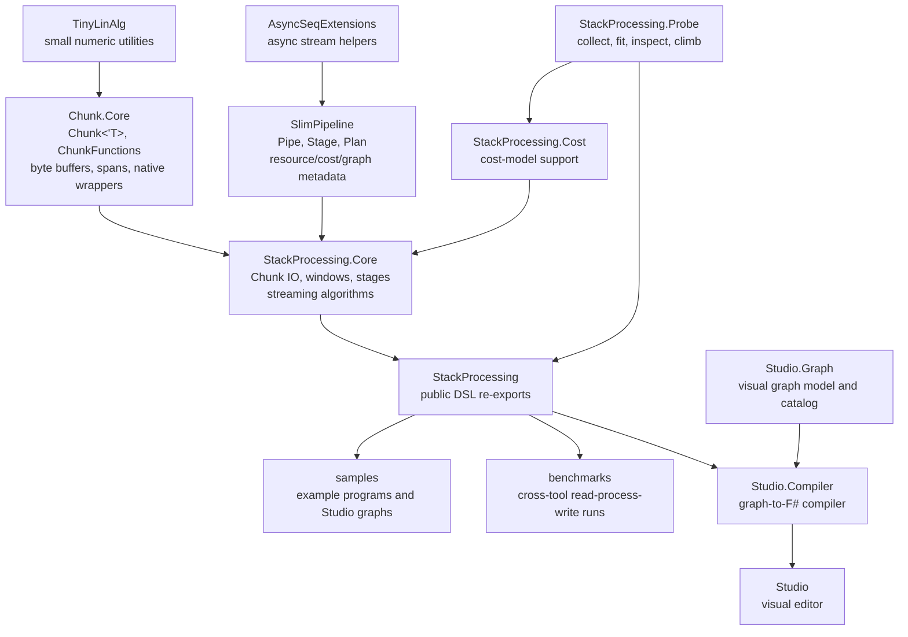

# Core Concepts

This note summarizes the active StackProcessing architecture. The central image
payload is `Chunk<'T>`: a typed, byte-backed, reference-counted block used by
IO, image-processing stages, reducers, Studio lowering, samples, and probing.

## Project Map

The repository is organized around a few focused layers:

- `AsyncSeqExtensions` supplies asynchronous stream helpers.
- `SlimPipeline` supplies generic `Pipe`, `Stage`, `Plan`, resources, memory
  models, cost models, and graph metadata.
- `Chunk.Core` owns `Chunk<'T>`, typed span access, ownership helpers, and
  chunk-local algorithms in `ChunkFunctions`.
- `StackProcessing.Core` binds Chunk algorithms to streaming stages, IO,
  windows, parallel collection, native backends, cost terms, and graph labels.
- `StackProcessing` re-exports the public DSL.
- Studio, Probe, samples, benchmarks, and cost tooling sit around that core.



`SlimPipeline` stays domain-agnostic. `Chunk.Core` stays payload- and
algorithm-focused. `StackProcessing.Core` is the binding layer where chunks
become memory-aware, costed, graph-visible stream elements.

## Values, Effects, And Streams

`'T` is an ordinary value. `unit` means no meaningful value and is used for
sources, sinks, side-effect completion, and synchronization points.

`Async<'T>` is a delayed computation producing one value. `AsyncSeq<'T>` is a
delayed asynchronous sequence. StackProcessing uses `AsyncSeq` for streams of
chunks, windows, scalar reducer values, points, meshes, charts, and side-effect
steps.

## Chunk

`Chunk<'T>` is the image payload for StackProcessing stages. It is an owned
byte buffer with a logical payload length, shape, typed span access, and
explicit release semantics.

```fsharp
type Chunk<'T when 'T: equality> =
    { Size: uint64 * uint64 * uint64
      Bytes: byte[]
      ByteLength: int
      Release: unit -> unit
      RefCount: int ref }
```

The byte-backed representation is deliberate:

- TIFF, Zarr, and native backends naturally move bytes.
- Typed spans give fast scalar access without changing the storage contract.
- `ArrayPool<byte>` buffers can be returned promptly through `Chunk.decRef`.
- Vector and complex chunks are represented as component-interleaved or
  component-extended chunk payloads instead of separate image objects.

`ChunkFunctions` owns chunk-local algorithms: casts, scalar and pair math,
comparisons, histograms, reducers, padding/cropping/permutation, finite
difference kernels, convolution, smoothing, binary morphology, vector
operations, complex helpers, FFT wrappers, statistics, quantiles,
equalization, resampling helpers, and derivative-family functions.

## Pipe

`Pipe<'S,'T>` is the lowest SlimPipeline abstraction above `AsyncSeq`:

```fsharp
AsyncSeq<'S> -> AsyncSeq<'T>
```

It is the executable stream transformer. Pipes have a name, an `Apply`
function, and a coarse streaming profile. They execute streams but do not carry
the full planning metadata used by StackProcessing.

## Stage

`Stage<'S,'T>` is the reusable operation unit:

```fsharp
Stage<'S,'T>
```

A stage contains a delayed pipe builder plus metadata:

- profile transition
- memory model
- time cost model
- element-size transformation
- slice-cardinality transformation
- graph nodes and edges
- cleanup actions

Stages are composed internally with:

```fsharp
-->
```

This keeps public DSL functions compact while preserving enough internal
structure for memory accounting and future optimizer visibility.

## Plan

`Plan<'S,'T>` is the user-facing deferred computation:

```fsharp
source availableMemory
>=> readStage
>=> processStage
>=> writeStage
|> sink
```

The stages are not run while the plan is built. The plan accumulates graph
structure, estimated memory peak, cost terms, sequence length estimates,
element-size estimates, debug flags, optimization flags, and source metadata.

Execution happens only at `sink`, `drainSingle`, `drainList`, or `drainLast`.

## Windows

`Window<'T>` is a generic SlimPipeline concept:

```fsharp
type Window<'T> =
    { Items: 'T list
      EmitRange: uint * uint
      ReleaseCount: uint }
```

StackProcessing uses windows mostly as z-neighbourhoods over streams of
`Chunk<'T>` slices. They provide halo management for streaming 3D operations
without requiring the whole volume in memory. Stages emit only the valid center
range and release consumed chunks according to `ReleaseCount`.

`Stage.parallelCollect`, `Stage.parallelMap`, and `Stage.parallelReduce` build
on this shape. They group stream elements into bounded windows, process worker
local chunks or accumulators, preserve output order where needed, and apply the
same resource-release rules as ordinary streaming stages.

## Resources And Reference Counting

Chunks own pooled memory, so StackProcessing uses explicit retain/release
semantics:

- a stage releases input chunks after consuming them
- reusable chunks are retained first
- windows release the consumed prefix according to `ReleaseCount`
- sinks and reducers release chunks at the defined ownership boundary

SlimPipeline keeps this generic through `ResourceOps<'T>`. StackProcessing.Core
supplies chunk-specific retain/release and memory estimation.

The practical rule is:

> If a stage consumes a chunk, it releases it after use unless it has explicitly
> retained or copied it.

## Memory Model

SlimPipeline estimates memory through `StageMemoryModel` and
`StageMemoryEstimate`. Estimates distinguish input live memory, output live
memory, work memory, retained memory, and peak memory.

Plans accumulate the maximum estimated stage peak and reject plans that exceed
the available memory budget unless debug mode is being used for exploration.

## Time Cost Model

Time is represented using `StageTimeCostModel` and `StageTimeCostEstimate`.
Cost estimates can include CPU units, native units, IO bytes, IO operations,
calibration keys, and contextual tags.

Calibration coefficients turn cost units into estimated milliseconds. Probe
collects measurements, fit learns coefficients, and inspect checks model
quality.

## Slice Cardinality

`SliceCardinality` describes how a stage changes stream length:

- preserves the domain
- trims, skips, or takes from the domain
- reduces to a fixed count
- falls back to unknown

This lets a per-slice map, a strided window, a source, and a reducer contribute
different cost-event counts.

## Graph

Stages and plans carry a lightweight `PipelineGraph` used for debug
explanation, cost discrepancy logs, Studio lowering, and optimizer visibility.
The graph records public stage structure while compound stages can still keep
their implementation details internal.

## Studio

Studio is the visual graph environment. It expresses user intent and generates
StackProcessing DSL code. StackProcessing/SlimPipeline own execution semantics;
semantic optimization should work from stage and plan metadata, not generated
code string rewriting.

## Core Mental Model

```text
Chunk<'T>
    owned typed image payload backed by bytes

AsyncSeq<'T>
    asynchronous stream of values

Window<Chunk<'T>>
    bounded z-neighbourhood with release rules

Pipe<'S,'T>
    executable stream transformer

Stage<'S,'T>
    pipe builder plus memory/time/graph/cardinality metadata

Plan<'S,'T>
    deferred composed computation

sink/drain
    lower plan to pipe and execute
```

The main design theme is to keep image-processing DSLs pleasant while making
memory, ownership, cost, and streaming dependencies explicit.
