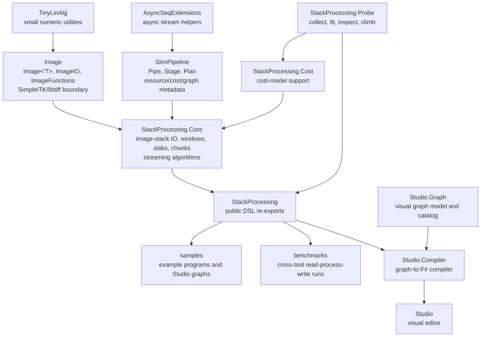

# Core Concepts

This note summarizes the high-level concepts still in active use across StackProcessing. It is intentionally more conceptual than [SlimPipeline.md](SlimPipeline.md), [Image.md](Image.md), or [StackProcessing.md](StackProcessing.md).

## Project Map

The repository is organized around a small set of layers. `Image` owns SimpleITK-facing image representation and single-image algorithms. `SlimPipeline` owns generic deferred stream execution. `StackProcessing.Core` binds those two layers into image-stack stages, plans, IO, cost terms, and higher-level algorithms. The public `StackProcessing` project re-exports the user-facing DSL. Studio, Probe, samples, and benchmarks sit around that core rather than inside it.



The important boundary is that only `Image` should talk directly to SimpleITK and low-level TIFF helpers where possible. `SlimPipeline` should remain image-agnostic. `StackProcessing.Core` is the binding layer where image values become resource-aware, memory-aware stream elements.

## Values, Effects, And Streams

### Plain Values

`'T` is an ordinary value:

```fsharp
let x: int = 42
```

There is no delay, no stream, and no resource protocol attached to the value itself.

### `unit`

`unit` means "no meaningful value". It is used for:

- source inputs that need no value
- sinks that produce no data result
- side-effect completion
- synchronization points

For example, `Plan<unit, Image<float32>>` is a source-like plan, while `Stage<Image<uint8>, unit>` is a sink-like stage.

### `Async<'T>`

`Async<'T>` is a delayed computation that eventually produces one value:

```fsharp
Async<'T>
```

It represents time and possible effects, not sequence structure. Running it requires an evaluator such as `Async.RunSynchronously`.

### `AsyncSeq<'T>`

`AsyncSeq<'T>` is a delayed asynchronous sequence:

```fsharp
AsyncSeq<'T>
```

It represents both:

- structure: a sequence of values
- time: each value may arrive later

StackProcessing uses `AsyncSeq` as the underlying execution model for streams of image slices, windows, slabs, points, scalar outputs, and side-effect steps.

## Pipe

`Pipe<'S,'T>` is the lowest SlimPipeline abstraction above `AsyncSeq`:

```fsharp
AsyncSeq<'S> -> AsyncSeq<'T>
```

It is the executable stream transformer. A pipe has:

- a name
- an `Apply` function
- a coarse streaming `Profile`

Examples:

- `Pipe<unit, Image<uint8>>`: source-like producer
- `Pipe<Image<uint8>, Image<float32>>`: transformer
- `Pipe<Image<uint8>, unit>`: sink-like consumer

Pipes execute streams. They do not by themselves carry the full planning metadata used by StackProcessing.

## Stage

`Stage<'S,'T>` is the main reusable operation unit:

```fsharp
Stage<'S,'T>
```

A stage contains a delayed pipe builder plus metadata:

- profile transition
- memory model
- time cost model
- element-size transformation
- slice-cardinality transformation
- graph nodes and edges
- cleanup actions

Stages are composed internally with:

```fsharp
-->
```

This operator is used heavily inside `StackProcessing.Core` to build ergonomic compound stages. For example, a window/slab operation can be implemented as several internal stages while remaining one public DSL function.

Conceptually:

```text
Stage = executable stream operation + model + graph + cleanup
```

## Plan

`Plan<'S,'T>` is the user-facing deferred computation:

```fsharp
Plan<'S,'T>
```

A plan is what users build when they write:

```fsharp
source availableMemory
>=> readStage
>=> processStage
>=> writeStage
|> sink
```

The stages are not run while the plan is built. Instead, the plan accumulates:

- the composed stage
- graph structure
- estimated memory peak
- cost observations and cost terms
- sequence length estimates
- element-size estimates
- debug and optimization flags
- optional source metadata

Execution happens only at:

- `sink`
- `drainSingle`
- `drainList`
- `drainLast`

This is StackProcessing's implemented deferred-computation model.

## Two Composition Levels

There are two important composition operators:

```fsharp
-->   // Stage -> Stage -> Stage
>=>   // Plan -> Stage -> Plan
```

Use `-->` for internal implementation structure.

Use `>=>` for user-facing pipeline structure.

The distinction matters:

- `-->` keeps public DSL functions ergonomic.
- `>=>` gives the plan layer a chance to record memory, time, graph, and cardinality information.

A current architecture question is how much of the internal `-->` graph should become visible to the Optimiser without forcing users to write low-level scaffolding. The preferred direction is to enrich the existing stage graph rather than invent a separate shadow representation.

## Profile

`Profile` describes the broad shape of a stream:

```fsharp
type Profile =
    | Unit
    | Constant
    | Streaming
    | Window of uint * uint * uint * uint * uint
```

Common interpretations:

- `Unit`: no meaningful stream payload
- `Constant`: scalar or constant result
- `Streaming`: ordinary one-element-at-a-time stream
- `Window`: streaming windows along one axis

Profiles are deliberately coarse. Detailed memory and time estimates live in stage cost models.

## Window

`Window<'T>` is a generic SlimPipeline concept:

```fsharp
type Window<'T> =
    { Items: 'T list
      EmitRange: uint * uint
      ReleaseCount: uint }
```

It represents a local group of stream elements, usually adjacent image slices in StackProcessing.

Important fields:

- `Items`: the retained elements
- `EmitRange`: which part of the window should be emitted later
- `ReleaseCount`: how many consumed elements should be released by resource-aware stages

Windows are central to StackProcessing's 1D streaming model for 3D image processing. A 3D operation can be expressed as a z-window over streamed 2D slices, which makes halo management local and memory bounded.

This is the key representation behind the streaming zonohedral binary morphology stages. Instead of converting each window into a full slab and applying a dense spherical operation, the zonohedral dilation and erosion stages compose short one-dimensional line operations. Each line stage uses the window halo it needs, emits only the valid center slices, and lets the resource rules release consumed images. The result is an approximation to a spherical structuring element that fits the streaming model more naturally than exact whole-slab morphology.

Connected components uses windows/slabs differently. Each slab is labelled independently, while only the first and last label slices are needed to discover which provisional labels touch across slab boundaries. The relabelling table is therefore local to slab boundaries rather than dense over all labels. In the reverse pass, unchanged labels are converted by slab base offset and only crossing labels consult the sparse equivalence-derived map.

## Slab

`Slab<'T>` is a StackProcessing.Core concept:

```fsharp
type Slab<'T> =
    { Image: Image<'T>
      EmitRange: uint * uint }
```

A slab is a stack of adjacent slices represented as one `Image<'T>`. It preserves enough range information to turn the slab back into a window and then into a slice stream.

Slabs are used when an operation is easier or faster to express as a whole 3D image operation, while still fitting into the streaming model:

```text
slice stream -> window -> slab -> image operation -> slab/window -> slice stream
```

This is especially useful for applying singleton-style image stages to small 3D slabs.

## Chunk

`Chunk<'T>` is a StackProcessing.Core concept:

```fsharp
type ChunkStorage<'T> =
    | ImageChunk of Image<'T>
    | ArrayChunk of 'T[,,]

type Chunk<'T> =
    { Index: int * int * int
      Origin: uint64 * uint64 * uint64
      Size: uint64 * uint64 * uint64
      Data: ChunkStorage<'T> }
```

A chunk is a bounded 3D block from a larger volume or chunked backing store. It sits beside `Window<'T>` and `Slab<'T>` as a representation for algorithms that need random access, multiple passes, or block-oriented IO.

The storage choice is explicit:

- `ImageChunk` stays close to Image/SimpleITK operations.
- `ArrayChunk` is for managed hot loops, interpolation, and cache-heavy algorithms.

The type currently acts as a structural hook. Existing affine resampling and FFT code still use some older path-based chunk helpers, but the intended direction is for chunk-native stages to expose their memory shape through `Chunk<'T>` rather than hiding it in temporary directories or local caches.

## Image

`Image<'T>` is StackProcessing's typed wrapper around SimpleITK images. It lives in the `Image` project and adds:

- a static F# pixel type
- name and index metadata
- reference counting
- bulk array conversion
- file IO for single image objects
- SimpleITK interoperability
- explicit SimpleITK ownership paths for deep-copy, aliasing, and consuming temporary images

`Image` should own single-image representation and operations. It should not own streaming, plans, cost fitting, or Studio graph logic.

## Resources And Reference Counting

Images wrap native resources, so StackProcessing uses explicit retain/release semantics:

- a stage releases input images after consuming them
- reusable images are retained first
- windows release the consumed prefix according to `ReleaseCount`

SlimPipeline keeps this generic through `ResourceOps<'T>`. StackProcessing.Core supplies the image-specific retain/release operations.

The practical rule is:

> If a stage consumes an image, it releases it after use unless it has explicitly retained or copied it.

## Memory Model

SlimPipeline estimates memory through `StageMemoryModel` and `StageMemoryEstimate`.

Memory estimates distinguish:

- input live memory
- output live memory
- work memory
- retained memory
- peak memory

Plans accumulate the maximum estimated stage peak and reject plans that exceed the available memory budget unless debug mode is being used for exploration.

## Time Cost Model

Time is represented using `StageTimeCostModel` and `StageTimeCostEstimate`.

Cost estimates can include:

- CPU cost units
- native cost units
- IO read/write bytes
- IO read/write operations
- calibration keys
- contextual tags

Calibration coefficients turn cost units into estimated milliseconds. The probe/fitting workflow learns these coefficients from measurements.

## Slice Cardinality

`SliceCardinality` describes how a stage changes stream length:

- preserves the domain
- trims/skips/takes from the domain
- reduces to a fixed count
- falls back to unknown

This is used to scale cost terms. A per-slice map, a strided window, and a reducer should not contribute the same number of cost events.

## Graph

Stages and plans carry a lightweight `PipelineGraph`.

The graph is used for:

- debug explanation
- cost discrepancy logs
- future optimizer visibility

It is currently mostly name/transition based. A likely future direction is to enrich graph nodes with semantic tags such as `Cast`, `WindowToSlab`, `SlabToWindow`, `Read`, and `Write`.

## Optimiser

The current optimiser work is measurement-driven. The probe tool collects evidence, fit estimates a calibrated cost model, and inspect checks quality and suggests additional measurements.

The runtime plan layer already records cost terms and graph structure, but it does not yet perform general rewrite search or alternative-plan generation.

The intended direction is:

- keep the public DSL ergonomic
- preserve internal stage structure through enriched graphs
- let the Optimiser choose among safe alternatives
- use measured cost models rather than hand-waving

## Studio

Studio is the visual/user-facing graph environment. It generates StackProcessing DSL code from saved graphs.

Important boundary:

- Studio should express user intent.
- StackProcessing/SlimPipeline should own execution semantics.
- Optimiser-facing rewrites should not rely on fragile generated-code string rewriting.

Studio graph normalization may still be useful for obvious UI-level simplifications, but semantic optimization should happen in the stage/plan model.

## Core Mental Model

The active architecture can be summarized as:

```text
Image<'T>
    single image object, SimpleITK-backed

AsyncSeq<'T>
    asynchronous stream of values

Pipe<'S,'T>
    executable stream transformer

Stage<'S,'T>
    pipe builder plus memory/time/graph/cardinality metadata

Plan<'S,'T>
    deferred composed computation

sink/drain
    lower plan to pipe and execute
```

The main design theme is to keep high-level image-processing DSLs pleasant while making enough structure visible for memory-safe streaming, measurement, and future optimization.
